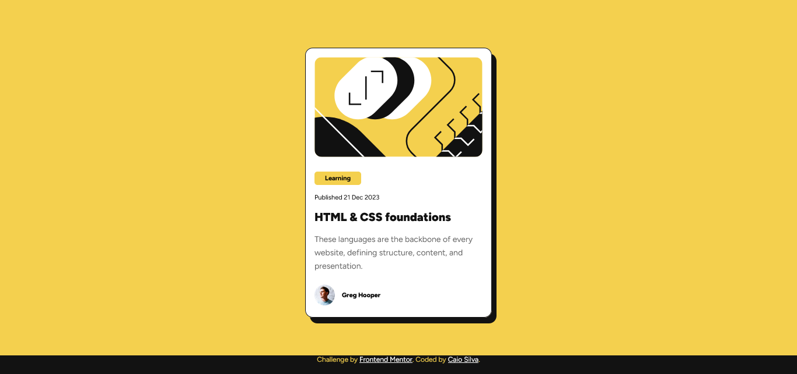
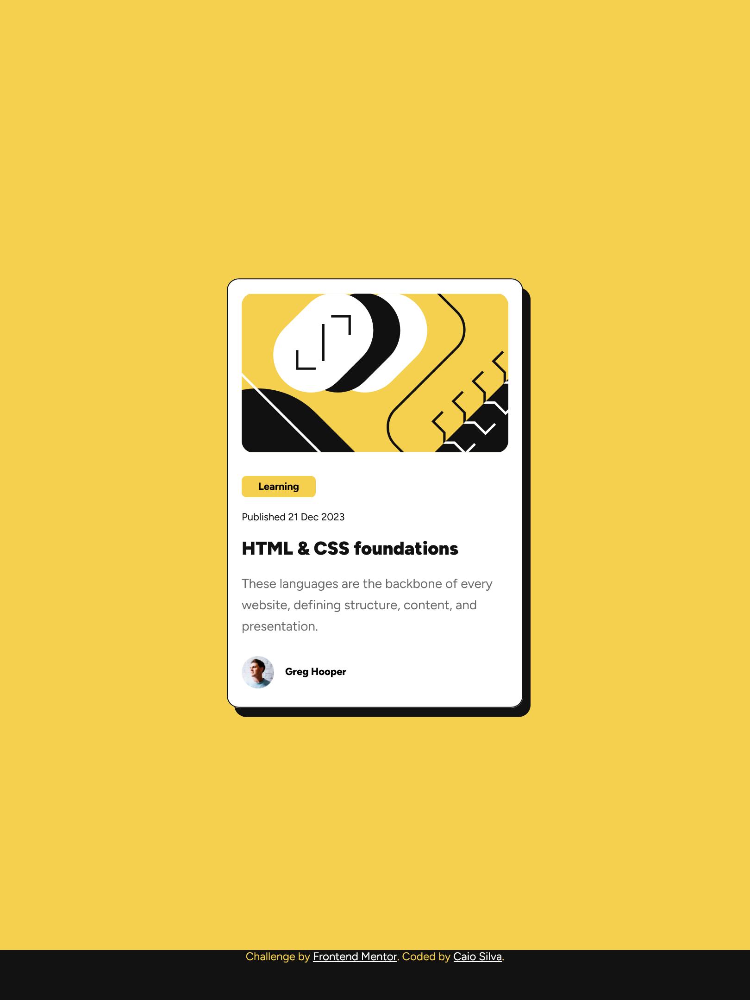
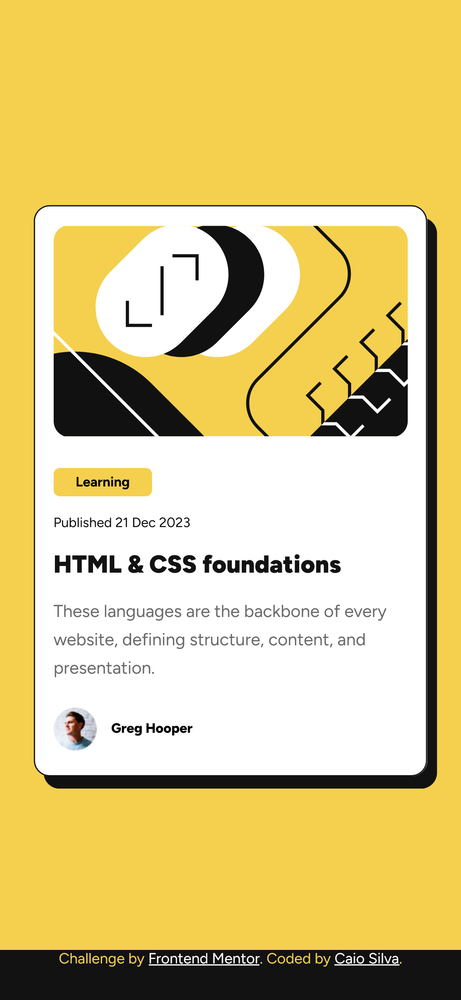

# Frontend Mentor - Blog preview card solution

Esta é minha solução para o desafio [Blog preview card challenge on Frontend Mentor](https://www.frontendmentor.io/challenges/blog-preview-card-ckPaj01IcS) no Front-End Mentor.

## Conteúdo

- [Overview](#overview)
  - [Screenshot](#screenshot)
  - [Links](#links)
- [Sobre o projeto](#sobre-o-projeto)
  - [Feito com](#feito-com)
  - [O que aprendi](#o-que-aprendi)
  - [Desenvolvimento contínuo](#desenvolvimento-contínuo)
  - [Recursos Extras](#recursos-extras)
- [Autor](#autor)
- [Agradecimentos](#agradecimentos)

## Overview

### Screenshot

- **Desktop | width >= 1366px**

- **Tablets | width: 810px**

- **Smartphones | width: 375px**

### Links

- Projeto URL: [Repositório GitHub](https://github.com/CaioLopes5556/MySolution-blog-preview-card-main)
- Live Site: [Deploy do Projeto](https://caiolopes5556.github.io/MySolution-blog-preview-card-main/)

## Sobre o projeto

### Feito com

- Semantic HTML5 markup
- CSS custom properties
- Flexbox

### O que aprendi

Para além do desafio proposto, consegui explorar algumas boas práticas no desenvolvimento do
código, como:

Utilização de variaveis CSS para auxiliar na manutenção das cores utilizadas neste projeto;

Utilização da unidade de medida REM, que ajuda na legibilidade e acessibilidade do projeto;

Organização dos arquivos;

### Desenvolvimento Contínuo

Continuarei estudando sobre métodos para deixar páginas webs responsivas a diferentes tamanhos de tela.
Ainda tenho algumas dúvidas em relação ao HTML semântico, então farei o posssível para aprender melhor
estes conceitos e saber qual tag utilizar em cada situação.

### Recursos Extras

- [MDN Web Docs](https://developer.mozilla.org/en-US/docs/Web/CSS) -
  Este site me ajudou a tirar dúvidas sobre o REM e variaveís CSS.

## Autor

- Frontend Mentor - [@CaioLopes5556](https://www.frontendmentor.io/profile/CaioLopes5556)
- Linkedin - [@caio-silva-42848a236](https://www.linkedin.com/in/caio-silva-42848a236)

## Agradecimentos

Gostaria de agradecer a comunidade do Front-End mentor pelo FeedBack no meu último projeto, ainda tô me acostumando a utilizar a plataforma e as dicas passadas foram importantes para a conclusão deste novo desafio.
